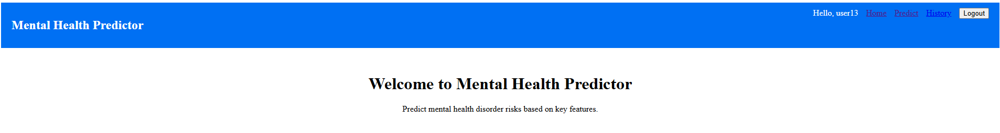
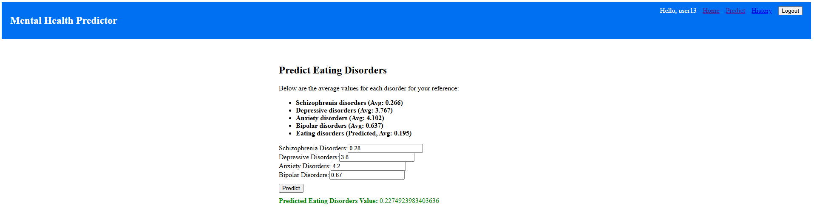

# Mental Health Disorder Prediction Full-Stack Application 📈🧠

This application is a **Full-Stack Project** developed to predict the prevalence of eating disorders based on the prevalence of several other mental health disorders. It leverages **Machine Learning**, **FastAPI**, **PostgreSQL**, and **Next.js** to provide a user-friendly interface for predictions. The backend is powered by Python (FastAPI) and PostgreSQL, while the frontend is built with Next.js (React) and JavaScript.

---

## 📸 Application Screenshots

### Home Page



### Prediction Page



---

## 📌 Table of Contents

* Overview
* Source of Data
* Project Purpose
* Tech Stack & Tools
* Project Structure
* Installation & Setup
* Running the Application
* API Endpoints
* Machine Learning Model
* Troubleshooting
* Contributing

---

## 🚀 Overview

This app is developed to provide insights into mental health disorder prevalence. Initially, it leverages a simple Linear Regression model trained on Kaggle mental health data to predict eating disorders based on:

* Schizophrenia disorders
* Depressive disorders
* Anxiety disorders
* Bipolar disorders

---

## 📊 Source of Data

The dataset is publicly available on Kaggle:

🔗 [Mental Health Dataset - Kaggle](https://www.kaggle.com/datasets/imtkaggleteam/mental-health)

---

## 🎯 Project Purpose

The goal of this project is to:

* Educate and visualize relationships between various mental health disorders.
* Provide a straightforward interface for predicting mental health metrics.
* Serve as a foundation for more complex predictive models.

---

## 🛠️ Tech Stack & Tools

**Frontend**

* Next.js
* Axios
* React-toastify (notifications)

**Backend**

* FastAPI
* SQLAlchemy
* PostgreSQL
* JWT Authentication

**Machine Learning**

* scikit-learn (Linear Regression)
* NumPy
* Pandas
* joblib (for serialization)

**Database**

* PostgreSQL

**Other Tools**

* dotenv for environment variables
* bcrypt for password hashing

---

## 📁 Project Structure

```
mental-illness-ml-app/
├── backend/
│   ├── models.py
│   ├── schemas.py
│   ├── database.py
│   ├── auth.py
│   ├── app.py
│   ├── requirements.txt
|   ├── mental-illnesses-prevalence.csv
|   ├── .env
|   ├── database_migrate.py
│   └── train.py
│
├── frontend/
│   ├── components/
│   │   ├── LoginForm.jsx
│   │   ├── RegisterForm.jsx
│   │   ├── Navbar.jsx
│   │   ├── PredictionForm.jsx
│   │   ├── PredictionHistory.jsx
│   │   └── ProtectedRoute.jsx
│   ├── pages/
│   │   ├── index.js
│   │   ├── predict.js
│   │   ├── history.js
│   │   ├── login.js
│   │   └── register.js
│   └── styles/
│       └── globals.css
│   ├── package.json
│
├── README.md
└── .gitignore
```

---

## 💻 Installation & Setup

### Step 1: Clone the Repository

```bash
git clone https://github.com/mahdimirmojarabian/mental-illness-ml-app.git
cd mental-illness-ml-app
```

### Step 2: Setup Backend (Python)

```bash
cd backend
python -m venv venv
source venv/bin/activate  # Linux/Mac
.\venv\Scripts\activate   # Windows
pip install -r requirements.txt
```

### Step 3: Database Setup (PostgreSQL)

1. Make sure you have PostgreSQL installed and running.
2. Open your PostgreSQL CLI or pgAdmin and run:

```bash
psql -U postgres
```

If you are asked for a password, enter the one you set during PostgreSQL installation.

3. Create a new database, new user, and grant privileges to the user:

```sql
CREATE DATABASE <DATABASE NAME>;
CREATE USER <YOUR_USERNAME> WITH PASSWORD '<PASSWORD>';
\c <DATABASE NAME>
GRANT ALL PRIVILEGES ON DATABASE <DATABASE NAME> TO <YOUR_USERNAME>;
GRANT ALL PRIVILEGES ON SCHEMA public TO <YOUR_USERNAME>;
ALTER DEFAULT PRIVILEGES IN SCHEMA public
GRANT ALL ON TABLES TO <YOUR_USERNAME>;
\q
```

4. Configure your `.env` file (Rename `.env.example` to `.env`):

```env
DATABASE_URL=postgresql://<USER NAME>:<PASSWORD>@localhost:5432/<DATABASE NAME>
SECRET_KEY=<YOUR_SECRET_KEY>
```

To generate a strong `SECRET_KEY`, run this in your terminal (Git Bash, or Linux):

```bash
openssl rand -base64 32
```

Copy the generated key and replace `YOUR_SECRET_KEY` with it.

5. Apply database migrations:

```bash
cd backend
python database_migrate.py
```

### Step 4: Setup Frontend

```bash
cd frontend
npm install
```

### Step 5: Train the Model

```bash
cd backend
python train.py
```

This generates a `ml_model.pkl` file containing the trained model and scaler.

### Step 6: Run the Application

**Run Backend**

```bash
cd backend
uvicorn app:app --reload --port 8000
```

**Run Frontend**

```bash
cd frontend
npx next dev -H localhost -p 4000
```

---

## 🚀 Application is live at:

* Frontend: [http://localhost:4000](http://localhost:4000)
* Backend API: [http://localhost:8000](http://localhost:8000)

---

## 📌 API Endpoints

| Endpoint    | Method | Description                              |
| ----------- | ------ | ---------------------------------------- |
| `/register` | POST   | Register a new user                      |
| `/login`    | POST   | User login to get JWT token              |
| `/predict`  | POST   | Make a prediction based on user input    |
| `/history`  | GET    | Fetch all past predictions of the user   |
| `/me`       | GET    | Fetch current user's profile information |

**Example Request (Prediction):**

```bash
POST /predict
{
  "schizophrenia": 0.5,
  "depression": 2.3,
  "anxiety": 3.1,
  "bipolar": 0.8
}
```

**Example Response:**

```json
{
  "prediction": 0.25,
  "schizophrenia": 0.5,
  "depression": 2.3,
  "anxiety": 3.1,
  "bipolar": 0.8
}
```

---

## 🤖 Machine Learning Model

The application uses a **Linear Regression Model** from `scikit-learn` to predict the prevalence of eating disorders based on four mental health metrics:

* Schizophrenia disorders
* Depressive disorders
* Anxiety disorders
* Bipolar disorders

The model is trained using Kaggle's mental health dataset, and the trained model along with its scaler is saved in `ml_model.pkl`. This is loaded in the backend to serve real-time predictions.

---

## 🔍 Troubleshooting

* **Database Connection Issues**: Ensure PostgreSQL is running and the `.env` file is correctly configured.
* **Model File Not Found**: Run `train.py` to generate `ml_model.pkl` if it is missing.
* **Frontend Not Loading**: Ensure you run `npx next dev -H localhost -p 4000` and access `http://localhost:4000`.
* **Authentication Errors**: Check if the JWT token is correctly stored in `localStorage` after login.
* **CORS Issues**: Ensure CORS is properly configured in `app.py`.

---

## 🤝 Contributing

1. Fork the repository.
2. Create your feature branch:

```bash
git checkout -b feature/AmazingFeature
```

3. Commit your changes:

```bash
git commit -m 'Add some AmazingFeature'
```

4. Push to the branch:

```bash
git push origin feature/AmazingFeature
```

5. Open a Pull Request.

Contributions are welcome and appreciated! 🎉
